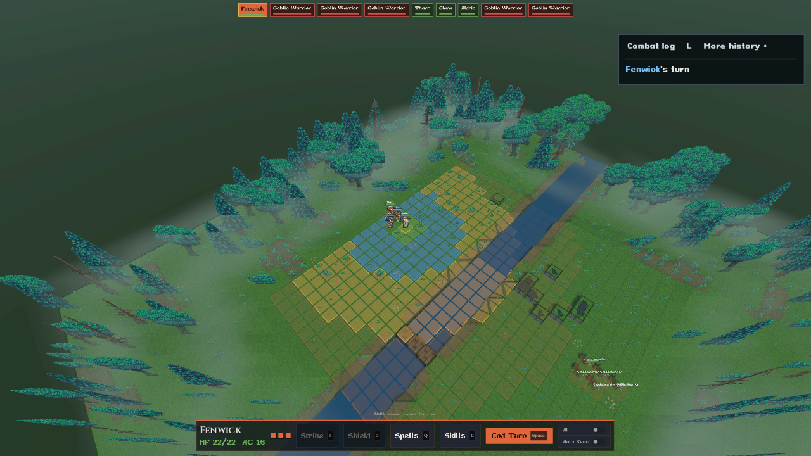
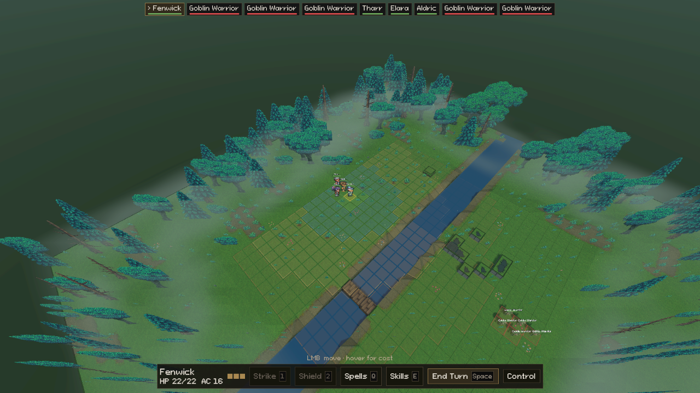

# Combat UI review

The combat HUD now gives more space and attention to the battlefield. Warm charcoal surfaces, parchment text, brass selection frames, and one pixel font replace the mix of orange fills, blue-gray panels, display lettering, and modern switches. This is an implemented cleanup of the current combat layout. Findings below are an expert review of the code and rendered states, not results from a player study.

## Reference principles

| Reference | Relevant design pattern | Application in Delve |
| --- | --- | --- |
| [XCOM 2 official manual, Game Screen and Action Points](https://www.feralinteractive.com/en/manuals/xcom2/latest/steam/) | Selected-unit information and actions have defined regions. Movement distinguishes one-action and two-action reach. | Keep the active ally and remaining actions beside commands. Retain movement cost bands, but reduce their opacity so the terrain remains readable. |
| [Final Fantasy Tactics: The War of the Lions official manual, hosted copy](https://manuals.plus/m/a9b30ee12e1602ae056012b39f666081747e020ee918e40d490b88b86007b9e5) | The result prediction screen presents expected effects and success probability before confirmation. | Give hit chance and damage the strongest forecast text. Put weapon, target, and attack bonus on a supporting line. Keep the game's bestiary masking intact. |
| [Baldur's Gate 3 publisher combat guide](https://www.spike-chunsoft.co.jp/pages/baldursgate3/guide2/) | Turn order, controlled-character state, and available actions have separate roles in the combat interface. | Reserve the top for initiative and the bottom for decisions. Keep the log as optional supporting detail and resolved dice in a corner. |

These are principles to adapt. Delve has three actions, automatic companions, reactions, and knowledge-gated enemy information; copying another game's HUD literally would obscure those rules.

## Findings and changes

| Priority | Finding | Implemented change |
| --- | --- | --- |
| High | Bright current-turn fill, colored initiative frames, orange command strip, orange End Turn, and colored vitals compete for attention. | Neutral panels, brass outlined selection, a textual current-turn arrow, and neutral HP/AC text. Team color remains in thin initiative health bars and inspection accents. |
| High | Several fonts and stock toggle switches make the HUD feel assembled from different products. | A combat-only theme uses Pixeloid throughout the command and initiative surfaces. Pixel square checkboxes replace switches. |
| High | AI and reaction preferences occupy the same permanent row as immediate tactical decisions. | A labeled Control button opens the active ally's preferences. It shares menu exclusivity and Escape dismissal with Spells and Skills. It remains available for controllable allies while the AI acts. |
| High | The opening log repeats the same active actor already shown in initiative and the command bar. | Turn headings appear in full history. A turn with no action produces no compact log panel. |
| Medium | The compact log reserves too much width and vertical attention for recent history. | Two recent actions instead of three, width 380 instead of 440 logical pixels, and a 220-pixel content cap instead of 360. Open details remain accessible and retain their state as new messages arrive. L opens full history. |
| High | Bottom-left hover inspection can collide with the centered command bar. | A bounded inspection card sits above the lower-left edge. Target names and conditions wrap. The attack forecast remains centered above commands. |
| Medium | Attack arithmetic in the forecast header competes with the decision itself. | Hit chance, damage formula, and crit chance lead. Weapon, target, and attack bonus support them. Target AC belongs to inspection. |
| High | A resolved die panel covers the central battlefield while the action unfolds. | The panel sits in the upper-left below initiative. Existing tumble, landing, arithmetic, outcome, and fade timing are preserved. |
| Medium | Large, saturated movement fills make the environment feel like a colored grid. | Lower fill opacity and quieter borders preserve the one/two/further-action distinction. Hover routes and cost pips remain available. |
| Medium | Rebuilding initiative or menus can temporarily leave old and new children together until frame-end deletion. | Detach old controls before freeing them, avoiding a frame of doubled layout. |

Not all repeated information is waste. The actor's name in initiative answers “who acts now?”, while the name beside commands answers “whose actions am I choosing?”. Health on units and health in the command bar serve different viewing contexts. Both stay. Off-guard remains visible in inspection and the forecast because it directly affects an attack decision.

## Information placement

| Player question | Home |
| --- | --- |
| Who acts now and who follows? | Top initiative strip; arrow and brass frame mark the actor. |
| What can this ally do? | Bottom command bar, remaining action pips, Spells and Skills menus. |
| What does this move cost? | Hover route and cost pips above commands. |
| What will this attack do? | Forecast above commands, before commitment. |
| What is known about this unit? | Lower-left hover inspection, with knowledge-masked HP and AC. |
| What just happened? | Upper-left resolved die and upper-right recent actions. |
| Why did it happen? | Expand an action's details or open full history with L. |
| Who controls this ally? | Control menu beside the commands. |

## Visual evidence

Same combat harness and camera pose, before and after:

Additional reviewed states:

- [Skills menu](after/combat_shot_skills.png)
- [Spell menu](after/combat_shot_flyout.png)
- [Control preferences](after/combat_controls.png)
- [Target inspection and forecast](after/combat_target_preview.png)
- [Recent actions](after/combat_log_compact.png)
- [Expanded action](after/combat_log_entry_expanded.png)
- [Full history](after/combat_log_history.png)
- [Resolved die with history open](after/combat_dice_roll.png)

The target/condition shot uses explicit presentation fixtures to exercise unknown values and wrapping. It is not an assertion that the starting encounter has that target in attack range. Images are 1280×720 review exports from the project's scaled combat viewport.

## Next UX priorities

1. **Connect initiative to the board.** Several enemies share “Goblin Warrior”, and initiative currently has no hover highlight or camera focus action. Add a shared unit identifier or portrait and bidirectional highlighting. This requires consistent identity across board labels, forecasts, and log entries; numbering only the initiative strip would create another mismatch.
2. **Show consequential movement risks before committing.** Keep cost visible, then add explicit threatened movement, difficult terrain, and reaction-risk explanations from the rules engine. Validate these against real path queries rather than inferring danger from color.
3. **Explain uncertainty in context.** The game correctly masks enemy defenses. A short contextual explanation of Recall Knowledge would make `?%` more useful to new players. It should appear only when relevant, not as permanent help text.
4. **Surface active-ally conditions near commands.** Currently, conditions live in hover inspection. A compact set of consequential conditions could reduce repeated hovering without turning the command bar into a full character sheet.
5. **Playtest density and turn pacing.** Compare time to locate the active unit, understand a move's cost, and find the cause of a miss. Review crowded encounters, long localized names, color-vision differences, UI scaling, and keyboard focus before treating the layout as final.

## Validation

All 29 README headless combat and campaign spikes passed. The rendered combat spike passed all 24 checks and saved the states above. Its added checks cover menu exclusivity, Escape dismissal, inspection/forecast separation, and unknown enemy values. The combat-log spike passed all 34 checks, including turn-only compact history staying hidden while full history retains its headings. Logs are recorded alongside this review.

The solution build succeeds with zero errors and no Delve compiler warnings. The external Pf2e.Core project emits clean-step permission warnings under this workspace sandbox. Building Delve with `dotnet build Delve.csproj -c Debug -p:BuildProjectReferences=false` succeeds with zero warnings and zero errors using the existing rules-engine assembly. Runtime logs also contain the existing unavailable certificate-store message and skipped malformed creature data entry. These are separate from the UI checks.
